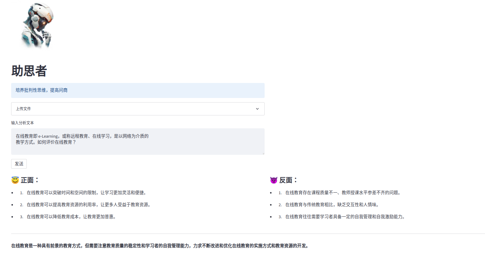

# thinking_mentor

use chatgpt to create a mentor help raise critique thought skill

## 背景
在AIGC大爆发的时代，个人将面临铺垫盖地的信息资料，其中不乏大量的虚假信息。如何不被迷惑，保持独立思考能力，使我们需要思考和解决的问题。

**我们的解决方案**
利用 chatGPT 来启发学生多维度看待问题，培养其批判性思维，提高问商。

## 项目成员:
[kevin-meng](https://github.com/kevin-meng)


[JACOB152](https://github.com/JACOB152)


## 界面截图


## 使用方法

1. Install dependencies:

```bash
pip install -r requirements.txt
```

2. Add API key to `.env`

```toml
[api_credentials]
api_key = "sk-..."
```

## Usage

To run the app use the following command:

```bash
streamlit run chat.py
```

Once the script is started, you can go to the URL [http://localhost:8501](http://localhost:8501) to start using the bot.

## License

This project is released under the [MIT License](LICENSE).


  
